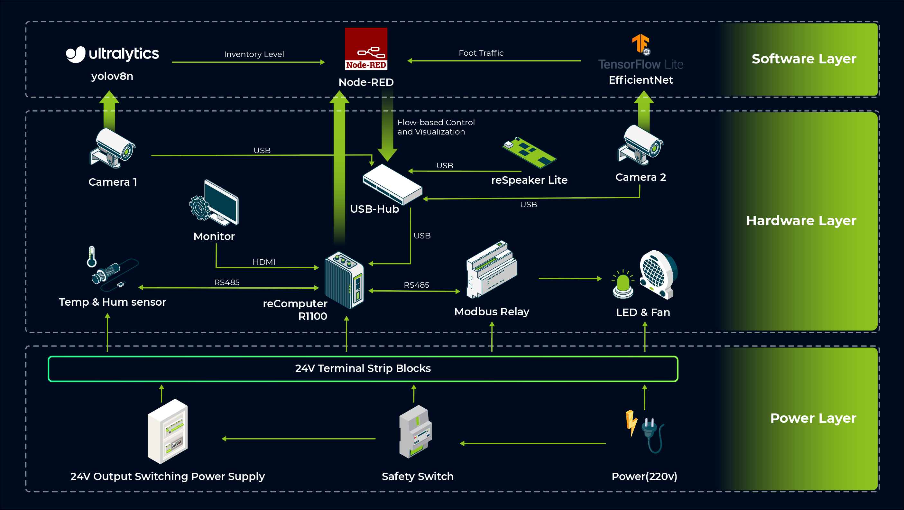
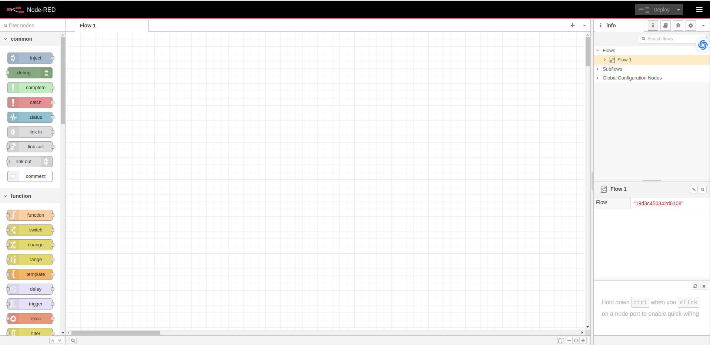
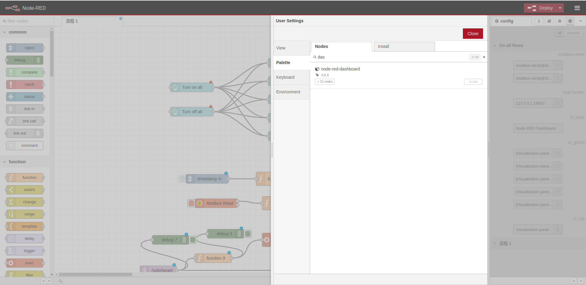
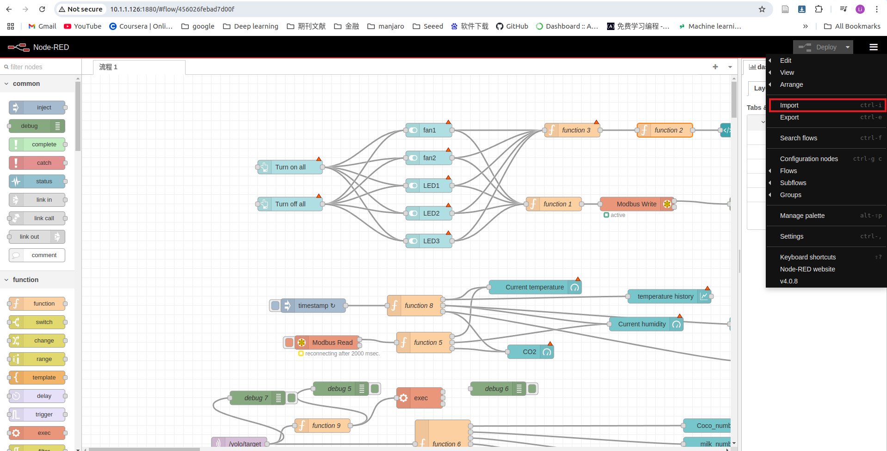
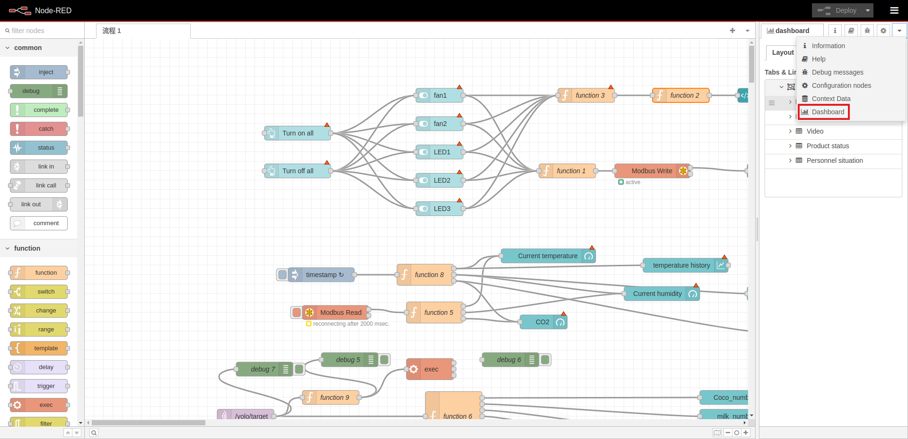
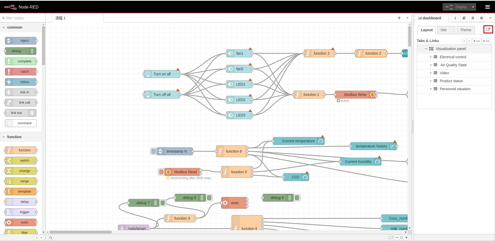

# Smart Retail with reComputerR11 and AI kit



This project demonstrates how to use the reComputer R11 and AI Kit to enhance your store, making it smarter and more efficient. 

We retrained the YOLOv8n model to detect Coca-Cola, chips, crackers, crisps, milk, and popcorn. The model is deployed on the AI Kit to monitor the inventory of these items on shelves, notifying store staff when restocking is needed. Additionally, we utilized a pre-trained EfficientNet model to detect people in the warehouse. This model, deployed on the CPU in TFLite format, helps prevent theft by identifying unauthorized intrusions.

Beyond inventory and security, we integrated environmental monitoring using temperature and humidity sensors. A ReSpeaker was added to emit alerts when intrusions are detected, notifying security personnel. Furthermore, we connected fans and lighting through RS485 for convenient operation by staff.

All data and controls are consolidated into a Node-RED dashboard, providing an intuitive interface for monitoring and managing store operations effectively.

## First: set up your environment

### Clone office example
```
git clone https://github.com/hailo-ai/hailo-rpi5-examples.git
```
### Setup environment

```
cd hailo-rpi5-examples && source setup.sh
```
### Install requirements

```
cd .. && pip install -r requirements.txt
```
### Post process compilation

```
cd hailo-rpi5-examples && ./compile_postprocess.sh
```

## Second: run Product_Detection

> **Note:**  
> /dev/video* will be your first usb camera 

```
cd ../Product_Detection && python detection_pipelin.py --hef-path ./yolov8n.hef -i /dev/video0 --labels-json ./config.json
```
## Third: run Warehouse_Monitoring

> **Note:**  
> '1' will be your second usb camera

you should open another terminal and run command below:
```
cd ../Warehouse_Monitoring/ && python app.py --device 1
```
## Fourth: run Node-RED

### Install mosquitto because the picture and message is sending by MQTT service:
```
sudo apt install -y mosquitto mosquitto-clients
```

### Install node-red:
```
bash <(curl -sL https://raw.githubusercontent.com/node-red/linux-installers/master/deb/update-nodejs-and-nodered)
```

### Enable node-red and start node-red:
```
sudo systemctl enable nodered.service
sudo systemctl start nodered.service
```

### Open node-red:
```
localhost:1880
```
The interface is like below:


### Install Dashboard and Modbus node:




### Import the workflow

```
cp nodered-workflow/flows.json ~/.node-red/lib/flows
```
And then, import flows like below:


### Deploy the flow, and the result is shown as below:


### Open Dashboard:
1. Click the Dashboard button.


2. Click the Dashboard button in the top right corner to open dashboard.


3. The result is shown like below:


## The result

<iframe width="800" height="600" src="https://www.youtube.com/embed/Sd5J5k863Vs" title="Making Next Gadget: Master AI with Raspberry Pi, Power Smart Retail Solutions" frameborder="0" allow="accelerometer; autoplay; clipboard-write; encrypted-media; gyroscope; picture-in-picture; web-share" referrerpolicy="strict-origin-when-cross-origin" allowfullscreen></iframe>